# Integrated Workflow: A Detailed Breakdown

This document provides a clear, step-by-step breakdown of the integrated workflow, combining the deterministic GitHub operations from `deterministic_github_ops.v2.yaml` with the structure of `simplified_workflow_system.md`. Each step is clearly labeled to indicate its nature (AI-driven or deterministic), its executor, and its implementation method.

## Core Principles

*   **Clarity:** Every step is explicitly defined, leaving no ambiguity about what is happening, how it's done, and who is responsible.
*   **Determinism:** Git and GitHub operations are fully automated through deterministic commands, ensuring consistency and reliability.
*   **Traceability:** GitHub save points are clearly marked, providing a complete audit trail of the development process.

## Detailed Workflow Breakdown

The following table breaks down the 25 operations of the simplified workflow, providing detailed information about each step.

| Phase | ID | Operation Name | Executor | Type | Implementation | Description | GitHub Save Point? |
| :--- | :- | :--- | :--- | :--- | :--- | :--- | :--- |
| **1: Plan & Route** | 001 | Analyze Modification Request | `planning_ai` | 🤖 [AI Decision] | `claude_code` / `gemini_cli` | Analyzes the user's request, attachments, and repository context to produce a set of modification requirements. | No |
| | 002 | Assess Complexity & Scope | `planning_ai` | 🤖 [AI Decision] | `claude_code` / `gemini_cli` | Evaluates the requirements to determine the complexity and scope of the changes. | No |
| | 003 | Determine Resource Allocation | `orchestrator` | 📜 [Deterministic Script] | `allocate_resources.py` | Based on the complexity assessment, this script allocates the necessary compute resources and sets budget limits. | No |
| | 004 | **Create Workspace Isolation** | `repo_coordinator` | ⚙️ [Deterministic Command] | `gh-init-workspace` | Initializes a new, isolated workspace for the modification task. This includes creating a new branch and setting up the worktree. | **Yes** |
| | 005 | Select Tools & Fallbacks | `orchestrator` | 📜 [Deterministic Script] | `select_tools.py` | Selects the primary and fallback tools for each task based on the complexity and resource plan. | No |
| | 006 | Establish Quality Gates | `orchestrator` | 📜 [Deterministic Script] | `set_quality_gates.py` | Defines the quality criteria that must be met for the changes to be accepted, such as test coverage and linting standards. | No |
| | 007 | Validate Plan Feasibility | `orchestrator` | 📜 [Deterministic Script] | `validate_plan.py` | Performs a final check to ensure that the execution plan is feasible and all dependencies are met. | No |
| | 008 | Initialize Cost Tracking | `orchestrator` | 📜 [Deterministic Script] | `init_cost_tracking.py` | Initializes the cost tracking system for the modification task. | No |
| **2: Execute & Validate** | 009 | Apply Code Modifications | `work_cli_tools` | 🤖 [AI Decision] | `aider` / `continue_vscode` | Applies the code modifications as defined in the execution plan. | No |
| | 010 | Resolve Immediate Conflicts | `work_cli_tools` | 🤖 [AI Decision] | `aider` / `continue_vscode` | Resolves any immediate conflicts that arise during the modification process. | No |
| | 011 | Apply Formatting Standards | `work_cli_tools` | ⚙️ [Deterministic Command] | `lint-all` | Applies consistent formatting and linting to the modified files. | No |
| | 012 | Generate Modification Summary | `planning_ai` | 🤖 [AI Decision] | `claude_code` / `gemini_cli` | Generates a summary of the changes that have been made. | No |
| | 013 | Syntax & Import Validation | `ide_validator` | ⚙️ [Deterministic Command] | `vscode-validate-all` | Performs a universal validation of syntax, imports, and types using the VS Code API. | No |
| | 014 | Apply Automated Fixes | `ide_validator` | ⚙️ [Deterministic Command] | `vscode-validate-all` | Applies automated fixes for any issues found during the validation process. | No |
| | 015 | Run Language-Specific Linting | `ide_validator` | ⚙️ [Deterministic Command] | `lint-all` | Runs language-specific linters to ensure code quality. | No |
| | 016 | Perform Security Scan | `ide_validator` | ⚙️ [Deterministic Command] | `snyk` / `bandit` | Scans the code for any security vulnerabilities. | No |
| | 017 | Run Existing Tests | `ide_validator` | ⚙️ [Deterministic Command] | `run-tests` | Executes the existing test suite to ensure that no regressions have been introduced. | No |
| | | **Commit & Push Changes** | `repo_coordinator` | ⚙️ [Deterministic Command] | `gh-checkpoint` | Commits the changes to the local repository and pushes them to the remote. | **Yes** |
| **3: Integrate & Ship** | 021 | **Create Integration Branch** | `repo_coordinator` | ⚙️ [Deterministic Command] | `gh-merge-workstreams` | Creates a new integration branch and merges the changes from the workstream branch. | **Yes** |
| | 022 | Run Integration Tests | `ide_validator` | ⚙️ [Deterministic Command] | `run-tests` | Runs the full suite of integration tests on the merged codebase. | No |
| | 023 | Generate PR Documentation | `planning_ai` | 🤖 [AI Decision] | `claude_code` / `gemini_cli` | Generates a detailed description for the pull request, including a summary of the changes and the results of the quality gates. | No |
| | 024 | **Create Pull Request** | `repo_coordinator` | ⚙️ [Deterministic Command] | `gh-create-pr` | Creates a new pull request for the changes. | **Yes** |
| | 025 | **Finalize Workflow Artifacts** | `repo_coordinator` | ⚙️ [Deterministic Command] | `gh-cleanup-branches`, `gh-release` | After the PR is merged, this command cleans up the temporary branches and creates a new release. | **Yes** |

## Visualized Workflow

```mermaid
graph TD
    A[Code Modification Request] --> B{Phase 1: Plan & Route};
    B --> C{Phase 2: Execute & Validate};
    C --> D{Phase 3: Integrate & Ship};

    subgraph "Phase 1"
        B1["001: Analyze Request (🤖 AI)"] --> B2["004: Create Workspace (⚙️ gh-init-workspace)"];
    end

    subgraph "Phase 2"
        C1["009: Apply Modifications (🤖 AI)"] --> C2["013: Validate Syntax (⚙️ vscode-validate-all)"];
        C2 --> C3["017: Run Tests (⚙️ run-tests)"];
        C3 --> C4["Commit & Push (⚙️ gh-checkpoint)"];
    end

    subgraph "Phase 3"
        D1["021: Create Integration Branch (⚙️ gh-merge-workstreams)"] --> D2["022: Run Integration Tests (⚙️ run-tests)"];
        D2 --> D3["024: Create PR (⚙️ gh-create-pr)"];
        D3 --> D4["025: Finalize (⚙️ gh-cleanup-branches, gh-release)"];
    end
```

## Configuration and Execution

The entire workflow is orchestrated by a central system that calls the appropriate tools and scripts for each step. The deterministic GitHub commands are executed using the `det.sh` shim, which reads the command definitions from the `deterministic_github_ops.v2.yaml` file.

This detailed breakdown provides a clear and actionable guide to the integrated workflow, enabling users to understand, execute, and troubleshoot the system with confidence.