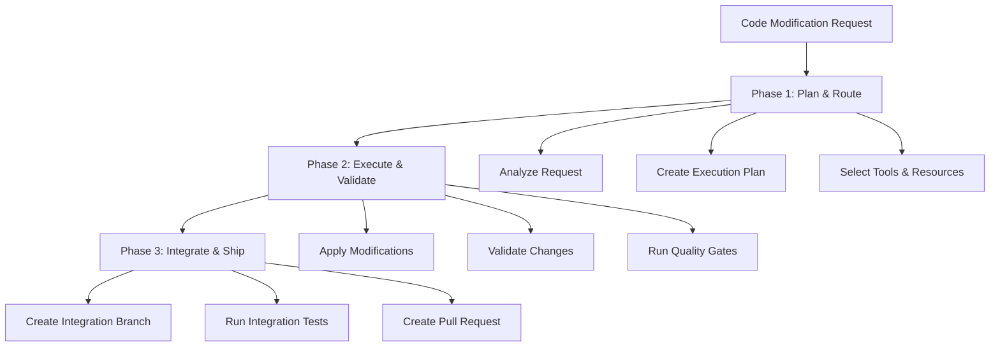

# Simplified Code Modification Workflow System

## Executive Summary

This document presents a pragmatic code modification workflow that distills the insights from complex multi-agent systems into a maintainable, cost-effective solution. The design emphasizes practical implementation over theoretical completeness, reducing a 400-atom workflow to 25 essential operations while preserving architectural soundness.

## Core Design Philosophy

### Simplicity Over Completeness
- **25 essential operations** instead of 400 atoms
- **3 phases** instead of 6 complex stages  
- **5 core roles** with clear responsibilities
- **Deterministic-first approach** with AI used only where necessary

### Practical Tool Integration
- Role-based tool assignment with realistic fallback chains
- Native VS Code integration for universal validation
- Aider CLI for automated code modifications
- Cost-conscious AI usage with hard limits

### Maintainable Architecture
- Clear handoffs between components
- Explicit failure handling and recovery
- Human oversight at critical decision points
- Measurable success criteria at each phase

---

## System Architecture

### Three-Phase Structure



### Five Core Roles

```yaml
planning_ai:
  purpose: Analyze requests, create modification plans, determine resource requirements
  primary_tool: claude_code
  fallback_tools: [gemini_cli, local_llm]
  cost_tier: premium
  
work_cli_tools:
  purpose: Apply deterministic code modifications, refactoring, formatting
  primary_tool: aider
  fallback_tools: [continue_vscode, manual_editing]
  cost_tier: standard
  
ide_validator:
  purpose: Universal syntax checking, error detection, quick fixes
  primary_tool: vscode
  fallback_tools: [language_servers, static_analyzers]
  cost_tier: free
  
repo_coordinator:
  purpose: Git operations, branch management, PR creation
  primary_tool: github_cli
  fallback_tools: [git_commands, github_api]
  cost_tier: free
  
orchestrator:
  purpose: Workflow coordination, state management, cost tracking
  primary_tool: custom_scripts
  fallback_tools: [github_actions, manual_process]
  cost_tier: free
```

---

## Phase 1: Plan & Route (8 operations)

**Objective**: Transform any input into executable modification plan
**Duration**: 2-5 minutes
**Cost Target**: <$1.00

### Entry Point Convergence [AI MAKES DECISIONS] (3 operations)
```yaml
operation_001: analyze_modification_request
  role: planning_ai
  input: [user_request, file_attachments, repo_context]
  output: modification_requirements.json
  
operation_002: assess_complexity_and_scope  
  role: planning_ai
  input: modification_requirements.json
  output: complexity_assessment.json
  
operation_003: determine_resource_allocation
  role: orchestrator
  input: complexity_assessment.json
  output: resource_plan.json
```

### Execution Planning [DETERMINISTIC] (3 operations)
```yaml
operation_004: create_workspace_isolation
  role: repo_coordinator
  input: resource_plan.json
  output: workspace_config.json
  
operation_005: select_tools_and_fallbacks
  role: orchestrator
  input: [complexity_assessment.json, resource_plan.json]
  output: tool_assignment.json
  
operation_006: establish_quality_gates
  role: orchestrator
  input: complexity_assessment.json
  output: quality_criteria.json
```

### Plan Validation [DETERMINISTIC] (2 operations)
```yaml
operation_007: validate_plan_feasibility
  role: orchestrator
  input: [resource_plan.json, tool_assignment.json, quality_criteria.json]
  output: execution_plan.json
  
operation_008: initialize_cost_tracking
  role: orchestrator
  input: execution_plan.json
  output: cost_budget.json
```

---

## Phase 2: Execute & Validate (12 operations)

**Objective**: Apply modifications and ensure quality
**Duration**: 5-20 minutes
**Cost Target**: <$2.00

### Code Modification [AI MAKES DECISIONS] (4 operations)
```yaml
operation_009: apply_code_modifications
  role: work_cli_tools
  input: [execution_plan.json, target_files]
  output: [modified_files, modification_log.json]
  
operation_010: resolve_immediate_conflicts
  role: work_cli_tools
  input: [modified_files, conflict_reports]
  output: [resolved_files, conflict_resolution.json]
  
operation_011: apply_formatting_standards
  role: work_cli_tools
  input: resolved_files
  output: [formatted_files, formatting_log.json]
  
operation_012: generate_modification_summary
  role: planning_ai
  input: [modification_log.json, conflict_resolution.json]
  output: change_summary.md
```

### Universal Validation [DETERMINISTIC] (4 operations)
```yaml
operation_013: syntax_and_import_validation
  role: ide_validator
  input: formatted_files
  output: [validation_report.json, quick_fixes.json]
  
operation_014: apply_automated_fixes
  role: ide_validator
  input: [formatted_files, quick_fixes.json]
  output: [corrected_files, fix_log.json]
  
operation_015: run_language_specific_linting
  role: ide_validator
  input: corrected_files
  output: lint_report.json
  
operation_016: perform_security_scan
  role: ide_validator
  input: corrected_files
  output: security_report.json
```

### Quality Gate Validation [DETERMINISTIC] (4 operations)
```yaml
operation_017: run_existing_tests
  role: ide_validator
  input: [corrected_files, test_discovery]
  output: test_results.json
  
operation_018: check_coverage_thresholds
  role: ide_validator
  input: [test_results.json, quality_criteria.json]
  output: coverage_report.json
  
operation_019: validate_performance_impact
  role: ide_validator
  input: [corrected_files, performance_benchmarks]
  output: performance_report.json
  
operation_020: aggregate_quality_metrics
  role: orchestrator
  input: [lint_report.json, security_report.json, test_results.json, coverage_report.json]
  output: quality_gate_results.json
```

---

## Phase 3: Integrate & Ship (5 operations)

**Objective**: Safely merge changes into main branch
**Duration**: 3-10 minutes
**Cost Target**: <$0.50

### Integration Preparation [DETERMINISTIC] (2 operations)
```yaml
operation_021: create_integration_branch
  role: repo_coordinator
  input: [corrected_files, quality_gate_results.json]
  output: integration_branch_info.json
  
operation_022: run_integration_tests
  role: ide_validator
  input: integration_branch_info.json
  output: integration_test_results.json
```

### Pull Request Creation [AI MAKES DECISIONS] (2 operations)
```yaml
operation_023: generate_pr_documentation
  role: planning_ai
  input: [change_summary.md, quality_gate_results.json, integration_test_results.json]
  output: pr_description.md
  
operation_024: create_pull_request
  role: repo_coordinator
  input: [integration_branch_info.json, pr_description.md]
  output: pr_info.json
```

### Completion [DETERMINISTIC] (1 operation)
```yaml
operation_025: finalize_workflow_artifacts
  role: orchestrator
  input: [pr_info.json, cost_budget.json, quality_gate_results.json]
  output: workflow_completion_report.json
```

---

## Tool Selection Framework

### Decision Matrix

```yaml
complexity_assessment:
  simple:
    criteria: "<5 files, <200 lines, no architecture changes"
    tools:
      planning_ai: gemini_cli
      work_cli_tools: continue_vscode
      cost_estimate: $0.25
      
  moderate:
    criteria: "5-20 files, 200-1000 lines, minor architecture changes"
    tools:
      planning_ai: claude_code
      work_cli_tools: aider
      cost_estimate: $1.50
      
  complex:
    criteria: ">20 files, >1000 lines, major architecture changes"
    tools:
      planning_ai: claude_code
      work_cli_tools: aider
      additional_review: human_oversight_required
      cost_estimate: $3.00
```

### Fallback Chain Logic

```yaml
tool_availability_check:
  primary_unavailable:
    action: automatic_fallback_to_secondary
    notification: log_fallback_event
    
  secondary_unavailable:
    action: fallback_to_tertiary
    notification: alert_user
    
  all_tools_unavailable:
    action: queue_for_manual_processing
    notification: escalate_to_human
```

---

## Quality Assurance Framework

### Risk-Based Gate Intensity

```yaml
low_risk_changes:
  criteria: ["documentation_only", "test_additions", "formatting_changes"]
  gates: [syntax_check, basic_linting]
  approval: automated
  
medium_risk_changes:
  criteria: ["feature_additions", "refactoring", "configuration_changes"]
  gates: [syntax_check, comprehensive_linting, unit_tests, security_scan]
  approval: peer_review_optional
  
high_risk_changes:
  criteria: ["core_business_logic", "security_changes", "database_migrations"]
  gates: [full_validation_suite, integration_tests, performance_tests]
  approval: senior_review_required
```

### Language-Specific Validation

```yaml
python:
  syntax: pylsp
  linting: [ruff, black, isort]
  type_checking: mypy
  testing: pytest
  security: bandit
  
javascript:
  syntax: typescript_language_server
  linting: [eslint, prettier]
  type_checking: typescript
  testing: jest
  security: semgrep
  
sql:
  syntax: sql_language_server
  linting: sqlfluff
  validation: schema_check
  testing: sql_unit_tests
  security: sql_injection_scan
```

---

## Cost Management System

### Budget Framework

```yaml
cost_limits:
  per_change: $3.00
  daily_developer: $15.00
  monthly_team: $300.00
  emergency_override: $10.00
  
cost_optimization:
  cache_duration: 24_hours
  batch_processing: enabled
  free_tier_preference: true
  cost_alerts: 80_percent_threshold
```

### Tool Cost Catalog

```yaml
tool_costs:
  claude_code: $0.03_per_1k_tokens
  gemini_cli: $0.01_per_1k_tokens
  aider: $0.02_per_1k_tokens
  vscode: $0.00
  github_cli: $0.00
  continue_vscode: $0.00
```

---

## State Management and Recovery

### Checkpoint Strategy

```yaml
checkpoint_frequency:
  after_planning: mandatory
  after_modifications: mandatory
  after_validation: mandatory
  before_integration: mandatory
  
rollback_triggers:
  validation_failure: automatic_rollback
  cost_exceeded: pause_and_alert
  tool_failure: attempt_fallback
  human_intervention: pause_workflow
```

### Failure Recovery

```yaml
recovery_strategies:
  syntax_errors:
    strategy: ide_validator_auto_fix
    fallback: human_review
    
  test_failures:
    strategy: work_cli_tools_fix_attempt
    fallback: planning_ai_reanalysis
    
  integration_conflicts:
    strategy: repo_coordinator_conflict_resolution
    fallback: manual_merge_request
    
  cost_overrun:
    strategy: downgrade_to_free_tools
    fallback: queue_for_next_budget_cycle
```

---

## Implementation Roadmap

### Week 1-2: Core Infrastructure
**Deliverables:**
- Basic orchestrator with 25-operation workflow
- Tool selection and fallback logic
- VS Code integration for validation
- Cost tracking system

**Success Criteria:**
- Execute simple modifications end-to-end
- Demonstrate tool fallback functionality
- Validate cost tracking accuracy
- Show basic quality gate operation

### Week 3-4: Advanced Features
**Deliverables:**
- Aider CLI integration for automated modifications
- Language-specific validation pipelines
- Risk-based quality gate scaling
- Integration testing framework

**Success Criteria:**
- Handle moderate complexity changes
- Demonstrate language-specific workflows
- Show risk-based gate adjustment
- Validate integration test execution

### Week 5-6: Production Readiness
**Deliverables:**
- Comprehensive error handling and recovery
- Performance optimization and caching
- Complete documentation and training
- Monitoring and alerting systems

**Success Criteria:**
- Production-level reliability
- Team adoption and training completion
- Performance benchmarks met
- Full disaster recovery capability

---

## Configuration Examples

### Basic Workflow Configuration
```yaml
# workflow_config.yaml
system:
  max_concurrent_workflows: 3
  default_timeout: 1800  # 30 minutes
  cost_alert_threshold: 0.8
  
roles:
  planning_ai:
    primary: claude_code
    fallback: [gemini_cli, local_llm]
    cost_limit: 2.00
    
  work_cli_tools:
    primary: aider
    fallback: [continue_vscode, manual_editing]
    cost_limit: 1.00
    
  ide_validator:
    primary: vscode
    fallback: [language_servers]
    cost_limit: 0.00
    
quality_gates:
  syntax_check: mandatory
  linting: mandatory
  unit_tests: risk_based
  integration_tests: high_risk_only
  security_scan: mandatory
```

### Language-Specific Overrides
```yaml
# python_config.yaml
extends: workflow_config.yaml

validation_tools:
  syntax: pylsp
  linting: [ruff, black, isort] 
  type_checking: mypy
  testing: pytest
  security: bandit
  
quality_thresholds:
  line_coverage: 80
  complexity_max: 10
  security_issues: 0
```

---

## Success Metrics

### Operational Targets
```yaml
performance_metrics:
  average_execution_time: "< 15 minutes"
  success_rate: "> 95%"
  rollback_rate: "< 3%"
  cost_per_change: "< $2.50"
  
quality_metrics:
  defect_escape_rate: "< 1%"
  test_coverage_maintenance: "> 80%"
  security_vulnerability_rate: "0 tolerance"
  
user_experience_metrics:
  developer_satisfaction: "> 4.2/5.0"
  time_to_feedback: "< 5 minutes"
  manual_intervention_rate: "< 5%"
```

### Cost Analytics
```yaml
cost_tracking:
  total_monthly_spend: track_and_trend
  cost_per_developer: benchmark_optimization
  roi_calculation: time_saved_vs_cost
  tool_utilization: optimize_allocation
```

---

## Conclusion

This simplified workflow system provides practical automation for code modifications while maintaining architectural soundness. The 25-operation structure eliminates the complexity of 400-atom workflows while preserving essential functionality. The role-based tool assignment with realistic fallback chains ensures resilience without over-engineering.

The three-phase approach (Plan & Route, Execute & Validate, Integrate & Ship) provides clear workflow progression with explicit handoffs and quality gates. Cost management ensures economic viability while the risk-based quality framework maintains high standards without unnecessary overhead.

Success depends on disciplined implementation of the core principles: simplicity over completeness, practical tool integration, and maintainable architecture. Teams following this framework should expect 90%+ automation for routine changes while maintaining code quality and reducing development cycle times.